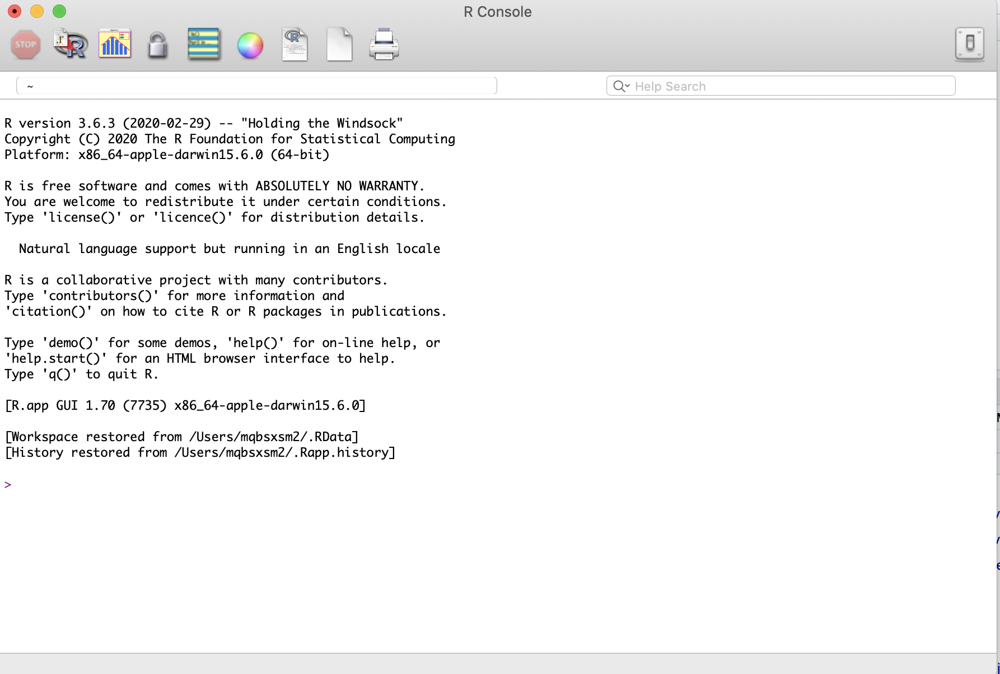
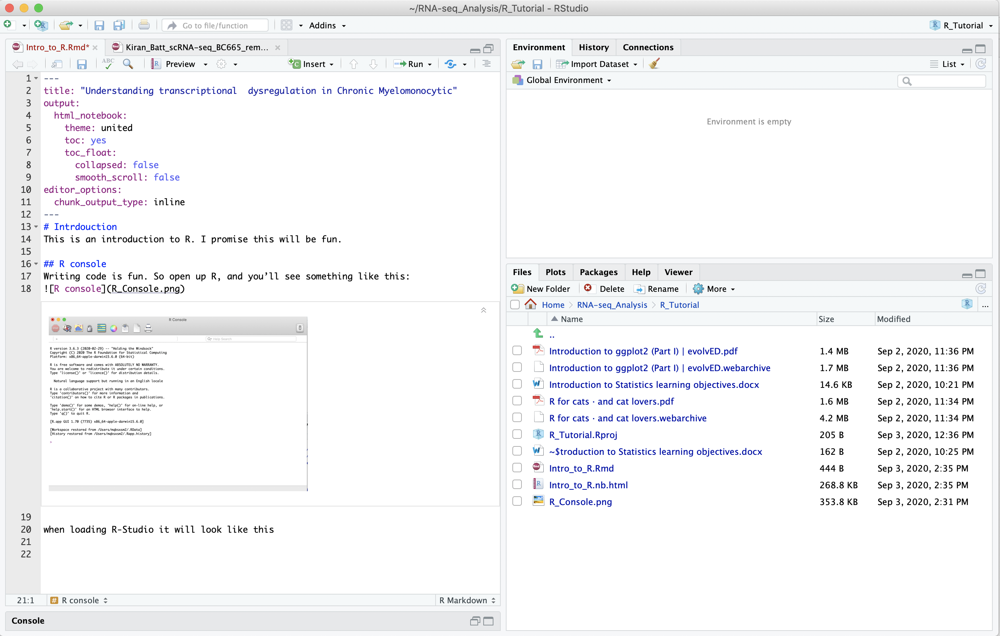

<table style="float:right;">
    <tr>
        <td>                      
            <div style="text-align: right"><a href="https://www.research.manchester.ac.uk/portal/syed.murtuzabaker.html" target="_blank">Syed Murtuza Baker</a></div>
            <div style="text-align: right">Research Fellow</div>
            <div style="text-align: right">University of Manchester</div>
         </td>
         <td>
             
         </td>
     </tr>
</table>

# Introduction to Programming with R
****

#### About this Notebook
This notebook introduces the R programming language and the Jupyter notebook environment. 

Level: <code>beginner</code> 

Duration: Approximately 2 hours to complete

<div class="alert alert-block alert-warning"><b>Learning Objectives:</b> 
<br/> At the end of this notebook you will be able to:
    
- Describe the basic principles of R language

- Log your work in a Jupyter notebook
    
- Explain the features of R that support object-oriented programming


</div> 

<a id="top"></a>

<b>Table of contents</b><br>

1.0 [Introduction](#intro)

2.0 [Variables](#variables)

3.0 [Vectors](#vectors)

4.0 [Data Frames](#dataframes)

5.0 [Lists](#lists)

6.0 [Indexing](#indexing)

7.0 [If Statement](#ifstatement)

8.0 [If...else Statement](#ifelsestatement)

9.0 [For Loop](#forloop)

10.0 [Functions](#functions)

11.0 [Your Turn](#yourturn)

*****

<a id="intro"></a>

## Introduction

R is one of the leading programming languages in Biological data analysis. It is used to perform data analyis, statistics, machine learning and visualisations. This course is designed as an introduction to R for participants with no previous programming experience. 

We first introduce on how to start programming in R and progress our way. We will learn how to manipulate data and visualise it, read and write to files. During the course we will also be working with tidyverse which will allow us to manipulate our data effectively.

For help in using this Jupyter notebook please refer to the [Jupyter Notebook User Guide](https://online.manchester.ac.uk/bbcswebdav/orgs/I3116-ADHOC-I3HS-HUB-1/Jupyter%20Notebooks/content/index.html#/)


<div class="alert alert-block alert-info">
<b>Task 1:</b>
<br> 
Let's run our very first R program to display the classic <code>Hello world</code> message on the screen. To do this select (click on) the cell below and hold the <code>shift</code> key and press the <code>enter</code> key at the same time. Alternatively click on the <code>run cell</code> button on the menu above. You should see <code>Hello world</code> displayed under the cell.
</div>

```{r}
hello.string <- 'Hello, world'
print(hello.string)
```


*****
[back to the top](#top)

<a id="variables"></a>

## Variables


Another thing you’ll want to do using R is assign things to a name so that you can use it later. Think of this as being if you were a chipmunk and you buried a nut in the ground to dig up later. You can assign anything in R to a name, then use it later (in the current R session of course :)).

Assign the number 5 to a variable named `mynumber`

```{r}
mynumber <- 5
```

Later you can use <code>mynumber</code> 

```{r}
mynumber
```

or add 1 to it

```{r}
mynumber + 1
```

### While working with variables

- We first need to know the data types. 
    - integers: 1, 5, 7
    - double: 1.5, 3.2
    - stings: Hellow
    - boolean: TRUE/FALSE
    - factor
    
- Variable Names: A valid variable name consists of letters, numbers, the dot or underline characters. It can start with a letter or a dot but not with a number. 

- Working with Strings (data length, changing test to lower case, check on spaces etc functions)

- changing a variable type

We will introduce the data types while going through vectors

<a id="vectors"></a>

## Vectors

Vectors are one of the simplest and common objects in R. Think of a vector like a cat’s tail. Some are short. Some are long. But they are are pretty much the same width - that is, they can only contain a single data type. So a vector can only have all <code>numeric</code> , <code>all character</code> , <code>all factor </code>, etc.

But how do we make a vector? The easiest way is to use a function called `c`. We start by creating an integer vector. 

#### Integer
An integer data type holds number without a fraction component. For eg. 2, 203 or 4007

Let us create the vector

```{r}
c(5,6,7)
```

`c(5,6,7)` will create a vector of numbers 5, 6, and 7.

#### Double
__Double__ repesents floating point numbers. 

```{r}
c(5, 8, 200, 1, 1.5, 0.9)
```

#### String
__String__ is used to store ordered sequences of characters, for e.g. "We are learning R". A string can contain any sequence of characters or can be repeated as well. A string is represted within a double-quote or a single-quote

Let us start with creating a String variable called `bird`

```{r}
bird <- "SimpleBird"
```

```{r}
bird
```

To know number of characters in a string we can use `nchar`

```{r}
nchar(bird)
```

We now add an additional space in between "Simple Bird" and print number of characters it has

```{r}
bird <- "Simple Bird"
```

```{r}
nchar(bird)
```

Now if we want to convert everything to upper case

```{r}
toupper(bird)
```

Similarly you can use `tolower` to make everything to lower case

```{r}
tolower(bird)
```

We now create a vector of three types of animals:

```{r}
animals <- c("birds","squirrels","fish")
animals
```

We can add additional texts with a variable using the `paste` function.

```{r}
paste(animals, "are beautiful")
```

#### Boolean

__Boolean__ is a logical variable that holds either `TRUE` or `FALSE`.

```{r}
are_you_good <- TRUE
are_you_good
```

#### Factor
Factor variables are categorical variables that can be either numeric or string variables.

```{r}
condition <- factor(c("Control","Control","Control","Treatment","Treatment"))
condition
```

In the example above, first line of the output shows all instances of each variable, and when you click on ‘Levels’, it gives an overview of each unique instance

If we are not sure and want to know the type of a variable we use the function `typeof`

```{r}
typeof(animals)
```

```{r}
typeof(are_you_good)
```


*****
[back to the top](#top)

<a id="dataframes"></a>
## Data Frames

A `data.frame` is one of the most commonly used objects in R. Just think of a `data.frame` like a table, or a spreadsheet, with rows and columns and numbers, text, etc. in the cells. A very special thing about the `data.frame` in R is that it can handle multiple types of data - that is, each column can have a different type. Like in the  table below the first column is of __numeric__ type, the second a __factor__, and the third __character__.

```{r}
df <- data.frame(hey=c(5,6,7), there=as.factor(c("a","b","c")),
             fella=c("blue","brown","green"))
df
```

We can quickly get a sense for the type of data in the df object by using the function str , which gives information on the types of data in each column.

```{r}
str(df)
```

### Matrices

Think of a matrix in R like a data.frame with all the same type of data, only numeric, only character, etc. A matrix is technically a special case of a two- dimensional array.

```{r}
mat <- matrix(c(1,2,3, 11,12,13), nrow = 2, ncol = 3)
```

```{r}
mat
```

*****
[back to the top](#top)

<a id="lists"></a>
## Lists

Lists are quite special. They are like vectors (but not vectors!), that can hold many other things. Using a cat tail analogy we can explain lists. Lists are like cat tails in that they can be short or long, but they can also vary in width. That is, they can hold any type of object. Whereas vectors can only hold one type of object (only character for example), lists can hold for example, a `data.frame` and a `numeric` , or a `data.frame` and another list! The way we make a list is via the function list

```{r}
list(1, "a")
```

We can also create nested list, i.e. list within list

```{r}
mylist <- list(1, list("a","b","c")) 
mylist
```

Just like vectors, we can do operations on each element of the list. However, since lists can be nested we have to worry about what level of nesting we want to manipulate.

```{r}
mylist[[1]]
```

```{r}
mylist[[2]]
```

```{r}
mylist[[2]][[1]]
```

*****
[back to the top](#top)

<a id="indexing"></a>
## Indexing

Okay, so far we have made a `vector`, `list`, and `data.frame`. Now the question is how do we get to the things in them? Its slightly different for each one. There is a general way to index objects in R that can be used across `vectors`, `lists`, and `data.frame`. That is the square bracket: []. For some objects we can index by the sequence number (e.g., 5 ) of the thing we want, while with others we can also index by the character name of the thing (e.g., kitty).

__One key point to remember here is that in R indexing starts with 1 whereas in some other languages like python it starts with 0__

### Indexing Vectors
Vectors only have one dimension, as we said above. So with [] there is only one number to give here. For example, let’s say we have the vector

```{r}
bb <- c(5,6,7)
```

We can index to each of those 3 numbers by the sequence of its place in the vector. We can get 6 by doing

```{r}
bb[2]
```

### Indexing Named Vectors

We can also have a named vector. A named vector is like `bb` above, but each of the three elements has a name.

```{r}
bb <- c(5,6,7)
names(bb) <- c("hey","hello","wadup") 
bb
```

```{r}
names(bb)
```

With a named vector we can get to each element in the vector using its name with a single set, or double set of brackets to get the value, or the value and name, respectively.

```{r}
bb["hello"]
```

```{r}
bb[["hello"]]
```

### Indexing Lists

Indexing on lists is similar to vectors. A huge difference though is that lists can be nested. So there could be infinite things within each slot of a list. For example, let’s say we have the nested list from above <code>mylist</code>

```{r}
mylist <- list(foo=1, bar=list("a","b","c"))
```

We can index to the first item in the list, including its name, by

```{r}
mylist[1]
```

Or equivalently

```{r}
mylist["foo"]
```

And get just the value by using two [

```{r}
mylist[[1]]
```

Or equivalently

```{r}
mylist[["foo"]]
```

### Indexing data.frame and matrix

Indexing on a <code>data.frame</code> and <code>matrix</code> is similar. Both have two things to index on: <code>rows</code> and <code>columns</code>. Within [,], the part before the comma is for rows, and the part after the comma for columns. Let us explore this with a build-in data fram in R called <code>iris</code>

```{r}
head(iris)
```

We can index to the third row and second column by doing

```{r}
iris[3,2]
```

We can also use names to index if you have named rows or columns. For example,

```{r}
iris[2,"Species"]
```

We can also use the $ symbol to index to a column, like

```{r}
mtcars$mpg
```

*****
[back to the top](#top)

<a id="ifstatement"></a>
## If Statement

Example of an if statement in real life could be:

*If it rains I bring my umbrella.*

The syntax of if statement is:

```
if (test_expression) {
  statement
}
```

If the test_expression is <code>TRUE</code>, the statement gets executed. But if it’s <code>FALSE</code>, nothing happens. Here, test_expression can be a logical or numeric vector, but only the first element is taken into consideration. In the case of numeric vector, zero is taken as <code>FALSE</code>, rest as <code>TRUE</code>

```{r}
x <- 5
if(x > 0){
  print("Positive number")
}
```

*****
[back to the top](#top)

<a id="ifelsestatement"></a>
## If...else Statement

Example of an If else statement in real life could be: 

*If it rains then I will bring my umbrella if not (else) then let's go*

The syntax of if… else statement is:

```{r}
x <- -5
if(x > 0){
  print("Non-negative number")
} else {
  print("Negative number")
}
```

*****
[back to the top](#top)

<a id="forloop"></a>
## For Loop

Loops allow you to automate your code when are used in programming to repeat a specific block of code.

```
for (val in sequence)
{
  statement
}
```

Here, sequence is a vector and val takes on each of its value during the loop. In each iteration, statement is evaluated.

### Example: for loop

Below is an example to count the instances of even numbers in a vector

```{r}
x <- c(2,5,3,9,8,11,6)
count <- 0
for (val in x) {
  if(val %% 2 == 0)  
    count = count+1
}
print(count)
```

*****
[back to the top](#top)

<a id="functions"></a>
## Functions

Functions are a small piece of code that allows user defined blocks of code to be reused as and where necessary. Functions make our life easier by allowing us to generalize many lines of code, and avoiding repeating ourselves. Functions make our work tidier as well. 

Functions are written like this

```{r}
I_want_to_add <- function(){
  2 + 3
}
```

```{r}
I_want_to_add()
```

```{r}
I_want_to_add <- function(a, b){
  a + b
}
```

```{r}
I_want_to_add(5,7)
```

__Do it yourself: change the value to 27, 12 and see the result__

#### Function within function

```{r}
foo <- function(){
  writeLines("Being a cat, I strongly dislike dogs")
}
```

Now call the <code>function</code>

```{r}
foo()
```

The foo function was pretty simple. We can also pass in parameters to the function.

```{r}
foo <- function(printVal){ 
  writeLines(printVal)
}
```

```{r}
foo("Being a cat, I strongly dislike dogs")
```

And set parameters to default values.

```{r}
foo <- function(printVal = "Being a cat, I strongly dislike dogs"){ 
  writeLines(printVal)
}
```

```{r}
foo()
```

```{r}
foo('I print whatever I like')
```

*****
[back to the top](#top)

## R console
Writing code is fun. So open up R, and you’ll see something like this:


## R studio
when loading R-Studio it will look like this


____________

<a id="yourturn"></a>
## Your Turn

<div class="alert alert-block alert-info">
    <b>Task 1</b><br/>
   <p> Write a chunk of code that converts 24 hour time into am/pm. If the time is more than 12 then it says it is now pm otherwise it says it is now am. Think about how to split the sequence of hours up into before midday and afterwards in order to write a simple if else statement</p> 
</div>

```{r}
inputTime <- 13
if(inputTime > 12){
  print('It is now pm')
}else{
  print("It is now am")
}

```

<div class="alert alert-block alert-info">
    <b>Task 2</b></br>
<p>Write for loop to calculate the first 10 terms of Fibonacci sequence.<br/>
The Fibonacci Sequence is the series of numbers: 0, 1, 1, 2, 3, 5, 8, 13, 21, 34,… i.e. the third number is calculated by adding up the two numbers before it:<br/>
[Hint: Assign the first two numbers in two variables and iterate from third variable]</p>
</div>

```{r}
a <- 0
b <- 1
print(a)
```

```{r}
print(b)
```

```{r}
for(i in 1:8){
  c <- a + b
  print(c)
  a <- b
  b <- c
}
```

<div class="alert alert-block alert-info">
    <b>Task 3</b> </br>
<p>Write a function that will say whether a number is prime or not.
</br>
[Hint: <code>%%</code> would give you the reminder of the calculation. For eg. <code>5%%2</code> will give you <code>1</code>]</p>

```{r}
find_prime <- function(val){
  count <- 0
  for (i in 2:(val/2)) {
    if(val%%i == 0)
      count = count + 1
  }
  #print(count)
  if(count > 0)
    print('It is not a prime number')
  else
    print('It is a prime number')
}
```

```{r}
find_prime(23)
```

```{r}
find_prime(21)
```

*****
[back to the top](#top)

### Notebook details
<br>
<i>Notebook created by <strong>Syed Murtaza Baker</strong>. Other contributors include Fran Hooley... 

Publish date: May 2021<br>
Review date: May 2022</i>

Please give your feedback using the button below:

****

## Notes:

